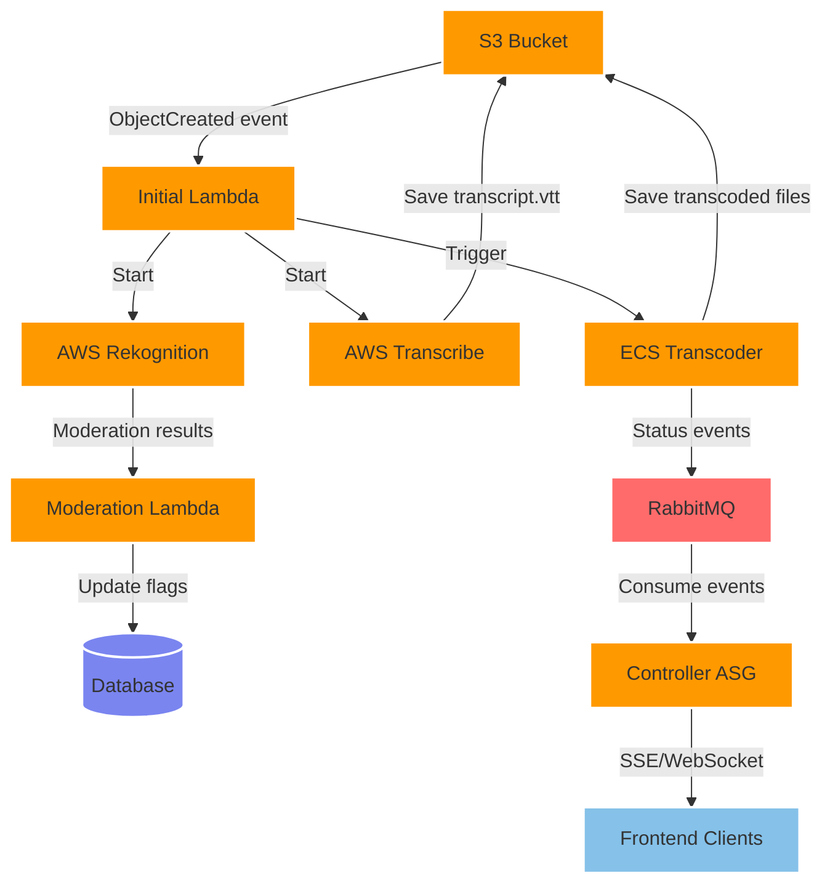

```mermaid
graph TD
    S3[S3 Bucket] -->|ObjectCreated event| Lambda1[Initial Lambda]
    
    Lambda1 -->|Trigger| ECS[ECS Transcoder]
    Lambda1 -->|Start| Transcribe[AWS Transcribe]
    Lambda1 -->|Start| Rekognition[AWS Rekognition]
    
    ECS -->|Save transcoded files| S3
    ECS -->|Status events| RMQ[RabbitMQ]
    
    Transcribe -->|Save transcript.vtt| S3
    
    Rekognition -->|Moderation results| Lambda2[Moderation Lambda]
    Lambda2 -->|Update flags| DB[(Database)]

    RMQ -->|Consume events| ASG[Controller ASG]
    ASG -->|SSE/WebSocket| FE[Frontend Clients]

    style S3 fill:#ff9900,stroke:#fff,stroke-width:2px
    style Lambda1 fill:#ff9900,stroke:#fff,stroke-width:2px
    style Lambda2 fill:#ff9900,stroke:#fff,stroke-width:2px
    style ECS fill:#ff9900,stroke:#fff,stroke-width:2px
    style Transcribe fill:#ff9900,stroke:#fff,stroke-width:2px
    style Rekognition fill:#ff9900,stroke:#fff,stroke-width:2px
    style DB fill:#7a85f0,stroke:#fff,stroke-width:2px
    style RMQ fill:#ff6b6b,stroke:#fff,stroke-width:2px
    style ASG fill:#ff9900,stroke:#fff,stroke-width:2px
    style FE fill:#85c1e9,stroke:#fff,stroke-width:2px
```