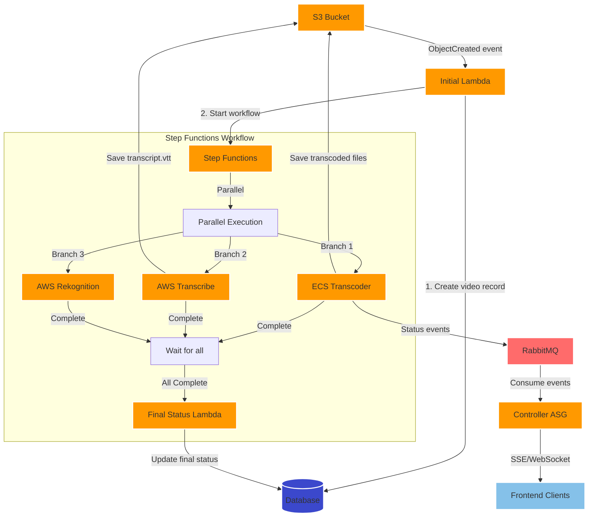

```mermaid
graph TD
    S3[S3 Bucket] -->|ObjectCreated event| Lambda1[Initial Lambda]
    
    Lambda1 -->|1. Create video record| DB[(Database)]
    Lambda1 -->|2. Start workflow| SF[Step Functions]
    
    subgraph "Step Functions Workflow"
        SF -->|Parallel| Para[Parallel Execution]
        Para -->|Branch 1| ECS[ECS Transcoder]
        Para -->|Branch 2| Transcribe[AWS Transcribe]
        Para -->|Branch 3| Rekognition[AWS Rekognition]
        
        ECS -->|Complete| Wait[Wait for all]
        Transcribe -->|Complete| Wait
        Rekognition -->|Complete| Wait
        
        Wait -->|All Complete| FinalLambda[Final Status Lambda]
    end
    
    ECS -->|Save transcoded files| S3
    ECS -->|Status events| RMQ[RabbitMQ]
    Transcribe -->|Save transcript.vtt| S3
    
    FinalLambda -->|Update final status| DB

    RMQ -->|Consume events| ASG[Controller ASG]
    ASG -->|SSE/WebSocket| FE[Frontend Clients]

    style S3 fill:#ff9900,stroke:#fff,stroke-width:2px
    style Lambda1 fill:#ff9900,stroke:#fff,stroke-width:2px
    style FinalLambda fill:#ff9900,stroke:#fff,stroke-width:2px
    style SF fill:#ff9900,stroke:#fff,stroke-width:2px
    style ECS fill:#ff9900,stroke:#fff,stroke-width:2px
    style Transcribe fill:#ff9900,stroke:#fff,stroke-width:2px
    style Rekognition fill:#ff9900,stroke:#fff,stroke-width:2px
    style DB fill:#3b48cc,stroke:#fff,stroke-width:2px
    style RMQ fill:#ff6b6b,stroke:#fff,stroke-width:2px
    style ASG fill:#ff9900,stroke:#fff,stroke-width:2px
    style FE fill:#85c1e9,stroke:#fff,stroke-width:2px
```