```mermaid
graph TB
    subgraph Host["Host Machine"]
        Client["🌐 External Client"]
    end

    subgraph Docker["Docker Network"]
        subgraph Storage["Storage Layer"]
            MinIO[(📦 MinIO Storage
:9000/:9001)]
            MySQL[(💾 MySQL DB
:3306)]
        end
        
        subgraph MessageBroker["Message Broker Layer"]
            RabbitMQ["📨 RabbitMQ
:5672/:15672"]
        end
        
        subgraph Services["Application Layer"]
            Controller["⚡ Controller Service
:3000"]
            Transcoder["🎬 Transcoder Service"]
        end
        
        subgraph Proxy["Proxy Layer"]
            Nginx["🔄 Nginx Proxy
:9005"]
        end
    end
    
    %% External connections from host
    Client -->|"HTTP :3000"| Controller
    Client -->|"HTTP :9005"| Nginx
    Client -->|"HTTP :15672"| RabbitMQ
    
    %% Internal connections
    Nginx ==>|"Proxy Pass"| MinIO
    Controller -.->|"AMQP :5672"| RabbitMQ
    Controller -.->|"S3 API"| MinIO
    Controller -.->|"SQL :3306"| MySQL
    Transcoder -.->|"AMQP :5672"| RabbitMQ
    Transcoder -.->|"S3 API"| MinIO
    
    %% Styling
    classDef external fill:#f96,stroke:#333,stroke-width:2px
    classDef storage fill:#58d,stroke:#333,stroke-width:2px
    classDef service fill:#5d8,stroke:#333,stroke-width:2px
    classDef proxy fill:#d85,stroke:#333,stroke-width:2px
    classDef broker fill:#85d,stroke:#333,stroke-width:2px
    
    class Client external
    class MinIO,MySQL storage
    class Controller,Transcoder service
    class Nginx proxy
    class RabbitMQ broker

    %% Link styles
    linkStyle default stroke:#666,stroke-width:2px
    linkStyle 0,1,2 stroke:#f66,stroke-width:3px
    linkStyle 3,4,5,6,7,8 stroke:#66f,stroke-width:2px,stroke-dasharray: 5 5
```

📒 *Note on Nginx's role*: Nginx acts as a proxy to make MinIO's presigned URLs accessible from outside Docker. Without it, the Controller would return URLs only valid within Docker's internal network (e.g., http://minio:9000/...). Nginx listens on port 9005 and forwards these requests to MinIO, allowing external clients to access the presigned URLs through localhost:9005 instead.
