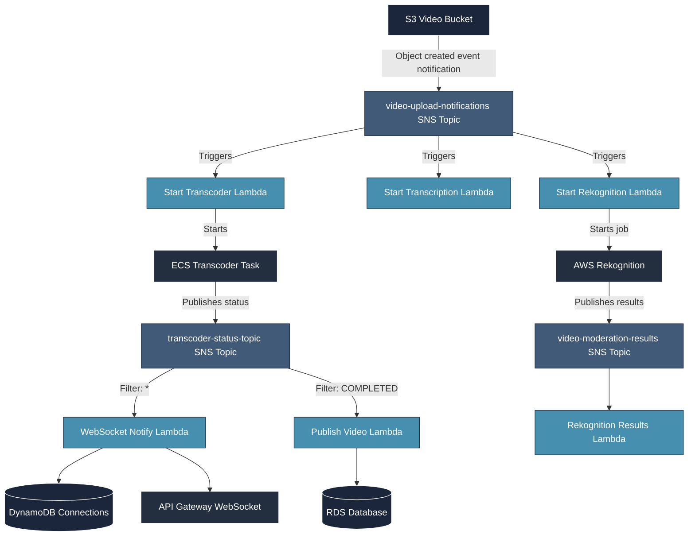
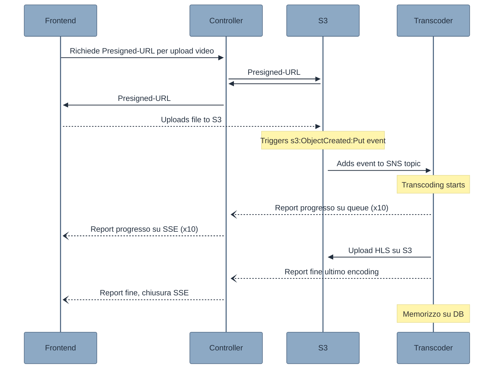
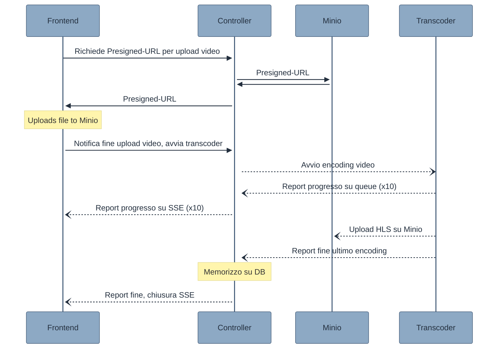
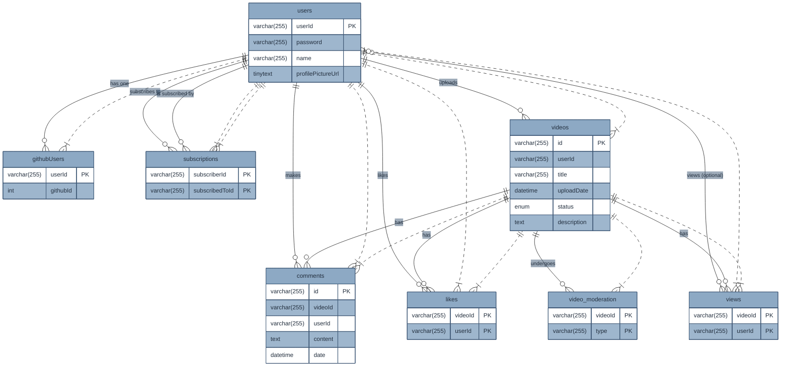

# Flusso di upload (su AWS)

```mermaid
graph TD
    %% Storage and Initial Trigger
    S3[S3 Video Bucket] -->|Object created event notification| SNS1[video-upload-notifications SNS Topic]

    %% Main Processing Branch
    SNS1 -->|Triggers| L1[Start Transcoder Lambda]
    SNS1 -->|Triggers| L2[Start Transcription Lambda]
    SNS1 -->|Triggers| L3[Start Rekognition Lambda]

    %% Transcoder Flow
    L1 -->|Starts| ECS[ECS Transcoder Task]
    ECS -->|Publishes status| SNS2[transcoder-status-topic SNS Topic]
    SNS2 -->|Filter: *| WS[WebSocket Notify Lambda]
    SNS2 -->|Filter: COMPLETED| PV[Publish Video Lambda]

    %% Rekognition Flow
    L3 -->|Starts job| REK[AWS Rekognition]
    REK -->|Publishes results| SNS3[video-moderation-results SNS Topic]
    SNS3 --> RES[Rekognition Results Lambda]

    %% WebSocket Flow
    WS --> DDB[(DynamoDB Connections)]
    WS --> API[API Gateway WebSocket]

    %% Database Updates
    PV --> RDS[(RDS Database)]

    %% Styling
    classDef sns fill:#415a77,stroke:#232f3e,color:white
    classDef lambda fill:#468faf,stroke:#232f3e,color:white
    classDef storage fill:#1b263b,stroke:#ffffff,color:white
    classDef aws fill:#232f3e,stroke:#232f3e,color:white

    class SNS1,SNS2,SNS3 sns
    class L1,L2,L3,WS,PV,RES lambda
    class S3,DDB,RDS storage
    class ECS,REK,API aws
```

# Flusso di upload (aws)

```mermaid
%%{init: {'theme':'base', 'themeVariables': {
  'primaryColor': '#8da9c4',
  'primaryTextColor': '#232f3e',
  'primaryBorderColor': '#415a77',
  'tertiaryColor': '#415a77',
  'edgeLabelBackground':'#415a77'
}}}%%
sequenceDiagram
    Frontend->>+Controller: Richiede Presigned-URL per upload video
    Controller->>+S3: Presigned-URL
    S3->>+Controller: 
    Controller->>+Frontend: Presigned-URL
    Frontend-->>+S3: Uploads file to S3
    Note over S3: Triggers s3:ObjectCreated:Put event
    S3->>+Transcoder: Adds event to SNS topic
    Note over Transcoder: Transcoding starts
    Transcoder--)Controller: Report progresso su queue (x10)
    Controller--)Frontend: Report progresso su SSE (x10)
    Transcoder->>S3: Upload HLS su S3
    Transcoder--)Controller: Report fine ultimo encoding
    Controller--)Frontend: Report fine, chiusura SSE
    Note over Transcoder: Memorizzo su DB
```
# Flusso di upload (in locale)

```mermaid
%%{init: {'theme':'base', 'themeVariables': {
  'primaryColor': '#8da9c4',
  'primaryTextColor': '#232f3e',
  'primaryBorderColor': '#415a77',
  'tertiaryColor': '#415a77',
  'edgeLabelBackground':'#415a77'
}}}%%
sequenceDiagram
    Frontend->>+Controller: Richiede Presigned-URL per upload video
    Controller->>+Minio: Presigned-URL
    Minio->>+Controller: 
    Controller->>+Frontend: Presigned-URL
    Note over Frontend: Uploads file to Minio
    Frontend->>+Controller: Notifica fine upload video, avvia transcoder
    Controller--)Transcoder: Avvio encoding video
    Transcoder--)Controller: Report progresso su queue (x10)
    Controller--)Frontend: Report progresso su SSE (x10)
    Transcoder--)Minio: Upload HLS su Minio
    Transcoder--)Controller: Report fine ultimo encoding
    Note over Controller: Memorizzo su DB
    Controller--)Frontend: Report fine, chiusura SSE
```
# Database

```mermaid
%%{init: {'theme':'base', 'themeVariables': {
  'primaryColor': '#8da9c4',
  'primaryTextColor': '#232f3e',
  'primaryBorderColor': '#415a77',
  'tertiaryColor': '#415a77',
  'edgeLabelBackground':'#415a77'
}}}%%

erDiagram

users {
varchar(255) userId PK
varchar(255) password
varchar(255) name
tinytext profilePictureUrl
}

githubUsers {
    varchar(255) userId PK
    int githubId
}

subscriptions {
    varchar(255) subscriberId PK
    varchar(255) subscribedToId PK
}

videos {
    varchar(255) id PK
    varchar(255) userId
    varchar(255) title
    datetime uploadDate
    enum status
    text description
}

comments {
    varchar(255) id PK
    varchar(255) videoId
    varchar(255) userId
    text content
    datetime date
}

likes {
    varchar(255) videoId PK
    varchar(255) userId PK
}

video_moderation {
    varchar(255) videoId PK
    varchar(255) type PK
}

views {
    varchar(255) videoId PK
    varchar(255) userId PK
}

users ||--o{ githubUsers : "has one"
users ||--o{ subscriptions : "subscribes to"
users ||--o{ subscriptions : "is subscribed by"
users ||--o{ videos : "uploads"
users ||--o{ comments : "makes"
users ||--o{ likes : "likes"
users o{--o{ views : "views (optional)"


videos ||--o{ comments : "has"
videos ||--o{ likes : "has"
videos ||--o{ video_moderation : "undergoes"
videos ||--o{ views : "has"

subscriptions }|..|| users : ""
subscriptions }|..|| users : ""
githubUsers }|..|| users: ""
videos }|..|| users : ""
comments }|..|| users: ""
likes }|..|| users: ""
views }|..o| users: ""
comments }|..|| videos : ""
likes }|..|| videos : ""
video_moderation }|..|| videos :""
views }|..|| videos : ""
```
