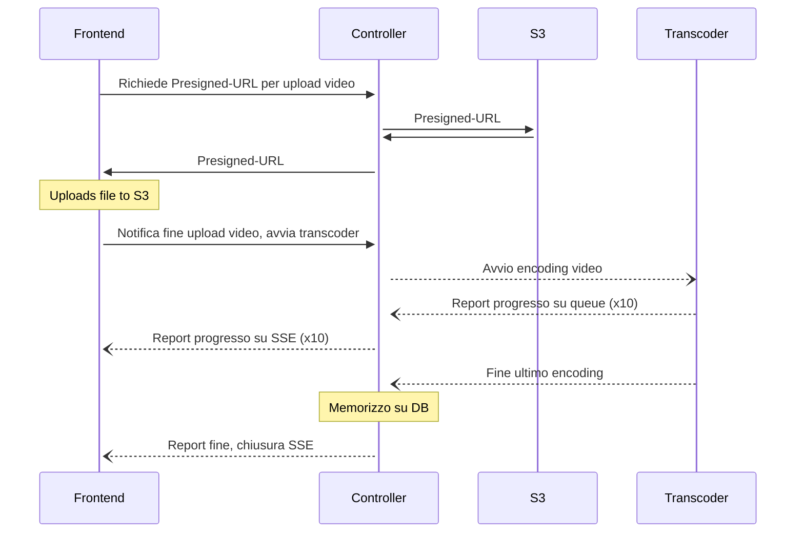

# Flusso di upload

```mermaid
sequenceDiagram
    Frontend->>+Controller: Richiede Presigned-URL per upload video
    Controller->>+S3: Presigned-URL
    S3->>+Controller: 
    Controller->>+Frontend: Presigned-URL
    Note over Frontend: Uploads file to S3
    Frontend->>+Controller: Notifica fine upload video, avvia transcoder
    Controller--)Transcoder: Avvio encoding video
    Transcoder--)Controller: Report progresso su queue (x10)
    Controller--)Frontend: Report progresso su SSE (x10)
    Transcoder--)Controller: Fine ultimo encoding
    Note over Controller: Memorizzo su DB
    Controller--)Frontend: Report fine, chiusura SSE
```