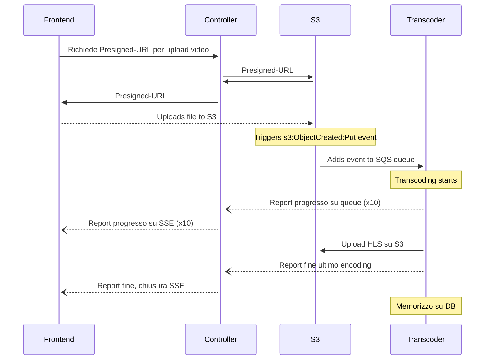
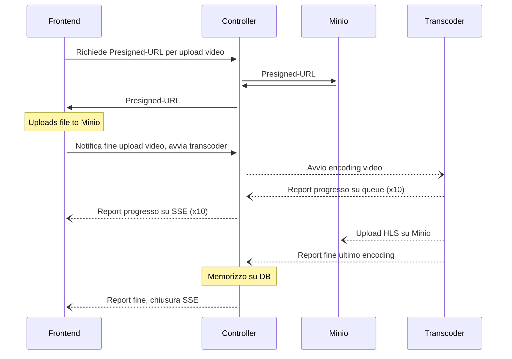

# Flusso di upload (su AWS)

```mermaid
sequenceDiagram
    Frontend->>+Controller: Richiede Presigned-URL per upload video
    Controller->>+S3: Presigned-URL
    S3->>+Controller: 
    Controller->>+Frontend: Presigned-URL
    Frontend-->>+S3: Uploads file to S3
    Note over S3: Triggers s3:ObjectCreated:Put event
    S3->>+Transcoder: Adds event to SQS queue
    Note over Transcoder: Transcoding starts
    Transcoder--)Controller: Report progresso su queue (x10)
    Controller--)Frontend: Report progresso su SSE (x10)
    Transcoder->>S3: Upload HLS su S3
    Transcoder--)Controller: Report fine ultimo encoding
    Controller--)Frontend: Report fine, chiusura SSE
    Note over Transcoder: Memorizzo su DB
```

# Flusso di upload (in locale)

```mermaid
sequenceDiagram
    Frontend->>+Controller: Richiede Presigned-URL per upload video
    Controller->>+Minio: Presigned-URL
    Minio->>+Controller: 
    Controller->>+Frontend: Presigned-URL
    Note over Frontend: Uploads file to Minio
    Frontend->>+Controller: Notifica fine upload video, avvia transcoder
    Controller--)Transcoder: Avvio encoding video
    Transcoder--)Controller: Report progresso su queue (x10)
    Controller--)Frontend: Report progresso su SSE (x10)
    Transcoder--)Minio: Upload HLS su Minio
    Transcoder--)Controller: Report fine ultimo encoding
    Note over Controller: Memorizzo su DB
    Controller--)Frontend: Report fine, chiusura SSE
```
