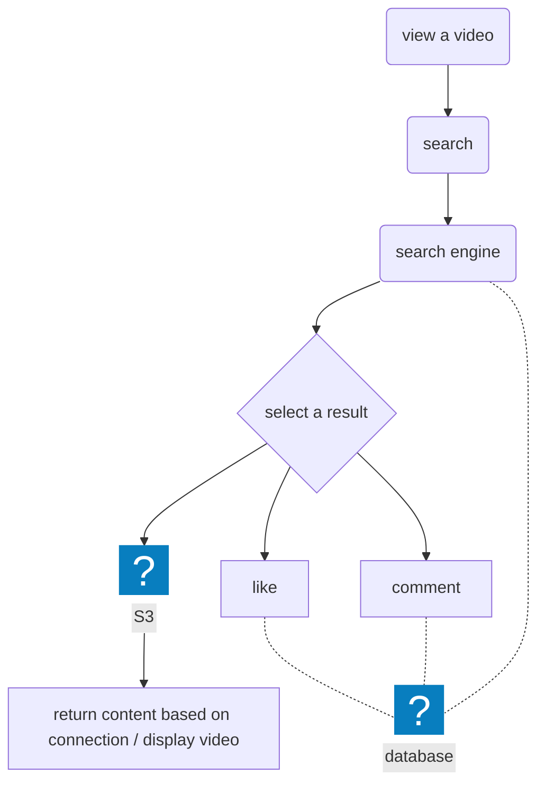

```mermaid
flowchart TD
    v("view a video") --> s("search")
    s --> se("search engine")
    se --> sel{"select a result"}
    se -.- n1["database"]
    sel-->n2["S3"]
    n2-->r[return content based on connection / display video]
    sel-->l[like]
    sel-->c[comment]
    l -.-n1
    c -.- n1


    n1@{ icon: "aws:res-database", pos: "b"}
    n2@{icon: "aws:res-database",pos:"b"}
```