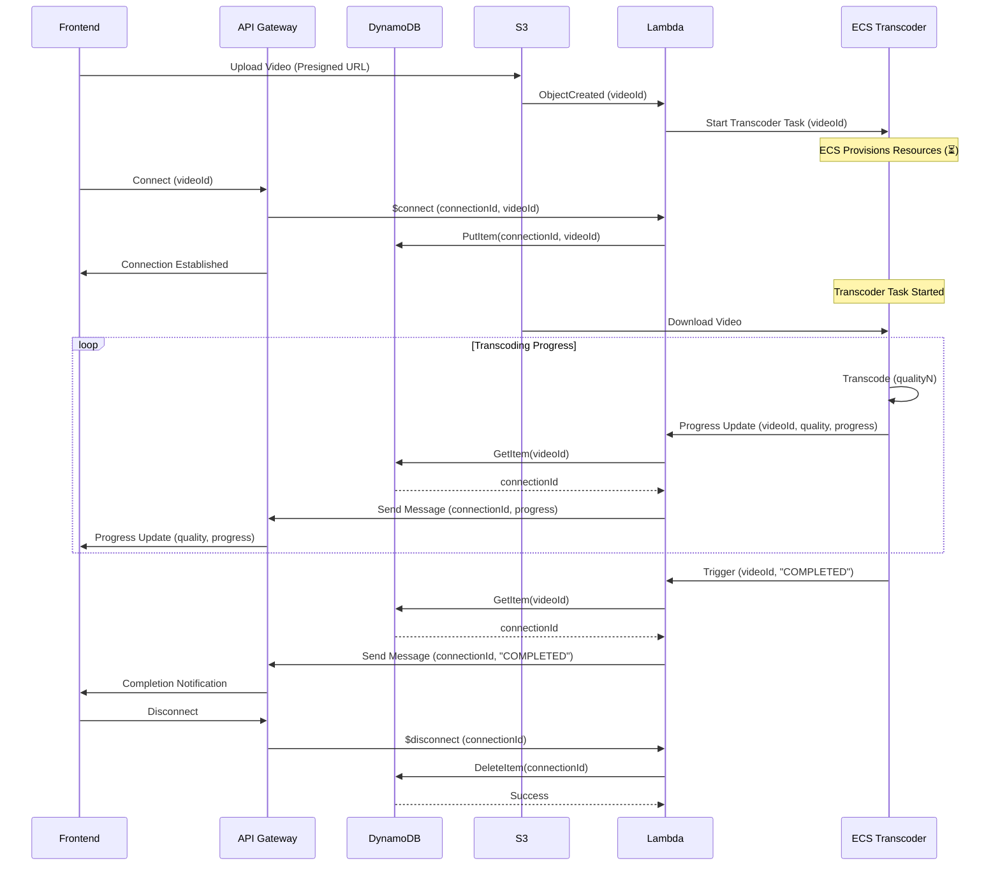
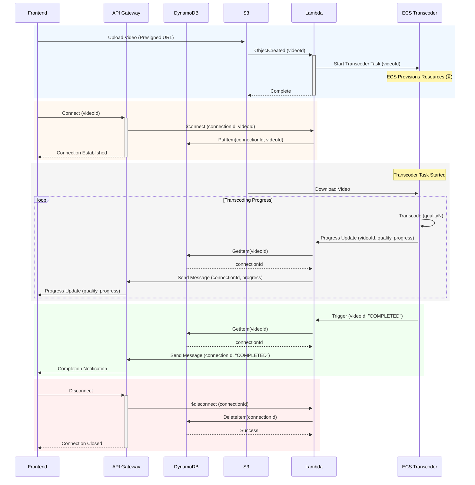

```mermaid
sequenceDiagram
    participant Client as Frontend
    participant APIGateway as API Gateway
    participant DynamoDB
    participant S3
    participant LambdaTrigger as Lambda
    participant ECSTranscoder as ECS Transcoder

    

    Client->>S3: Upload Video (Presigned URL)
    S3->>LambdaTrigger: ObjectCreated (videoId)
    LambdaTrigger->>ECSTranscoder: Start Transcoder Task (videoId)
    Note over ECSTranscoder: ECS Provisions Resources (⏳)

    Client->>APIGateway: Connect (videoId)
    APIGateway->>LambdaTrigger: $connect (connectionId, videoId)
    LambdaTrigger->>DynamoDB: PutItem(connectionId, videoId)
    APIGateway->>Client: Connection Established

    Note over ECSTranscoder: Transcoder Task Started


    S3->>ECSTranscoder: Download Video
    loop Transcoding Progress
        ECSTranscoder->>ECSTranscoder: Transcode (qualityN)
        ECSTranscoder->>LambdaTrigger: Progress Update (videoId, quality, progress)
          LambdaTrigger->>DynamoDB: GetItem(videoId)
          DynamoDB-->>LambdaTrigger: connectionId
          LambdaTrigger->>APIGateway: Send Message (connectionId, progress)
        APIGateway->>Client: Progress Update (quality, progress)
    end
    ECSTranscoder->>LambdaTrigger: Trigger (videoId, "COMPLETED")
      LambdaTrigger->>DynamoDB: GetItem(videoId)
          DynamoDB-->>LambdaTrigger: connectionId
      LambdaTrigger->>APIGateway: Send Message (connectionId, "COMPLETED")
        APIGateway->>Client: Completion Notification

    Client->>APIGateway: Disconnect
    APIGateway->>LambdaTrigger: $disconnect (connectionId)
    LambdaTrigger->>DynamoDB: DeleteItem(connectionId)
    DynamoDB-->>LambdaTrigger: Success
```

```mermaid
sequenceDiagram
    participant Client as Frontend
    participant APIGateway as API Gateway
    participant DynamoDB
    participant S3
    participant LambdaTrigger as Lambda
    participant ECSTranscoder as ECS Transcoder

    %% Upload Phase
    rect rgb(240, 248, 255)
        Client->>+S3: Upload Video (Presigned URL)
        S3->>+LambdaTrigger: ObjectCreated (videoId)
        LambdaTrigger->>ECSTranscoder: Start Transcoder Task (videoId)
        Note over ECSTranscoder: ECS Provisions Resources (⏳)
        LambdaTrigger-->>-S3: Complete
    end

    %% Connection Phase
    rect rgb(255, 248, 240)
        Client->>+APIGateway: Connect (videoId)
        APIGateway->>LambdaTrigger: $connect (connectionId, videoId)
        LambdaTrigger->>DynamoDB: PutItem(connectionId, videoId)
        APIGateway-->>-Client: Connection Established
    end

    %% Transcoding Phase
    rect rgb(245, 245, 245)
        Note over ECSTranscoder: Transcoder Task Started
        S3->>+ECSTranscoder: Download Video
        
        loop Transcoding Progress
            ECSTranscoder->>ECSTranscoder: Transcode (qualityN)
            ECSTranscoder->>+LambdaTrigger: Progress Update (videoId, quality, progress)
            LambdaTrigger->>DynamoDB: GetItem(videoId)
            DynamoDB-->>LambdaTrigger: connectionId
            LambdaTrigger->>APIGateway: Send Message (connectionId, progress)
            APIGateway->>Client: Progress Update (quality, progress)
        end
    end

    %% Completion Phase
    rect rgb(240, 255, 240)
        ECSTranscoder->>+LambdaTrigger: Trigger (videoId, "COMPLETED")
        LambdaTrigger->>DynamoDB: GetItem(videoId)
        DynamoDB-->>LambdaTrigger: connectionId
        LambdaTrigger->>APIGateway: Send Message (connectionId, "COMPLETED")
        APIGateway->>Client: Completion Notification
    end

    %% Cleanup Phase
    rect rgb(255, 240, 240)
        Client->>+APIGateway: Disconnect
        APIGateway->>LambdaTrigger: $disconnect (connectionId)
        LambdaTrigger->>DynamoDB: DeleteItem(connectionId)
        DynamoDB-->>LambdaTrigger: Success
        APIGateway-->>-Client: Connection Closed
    end
```
